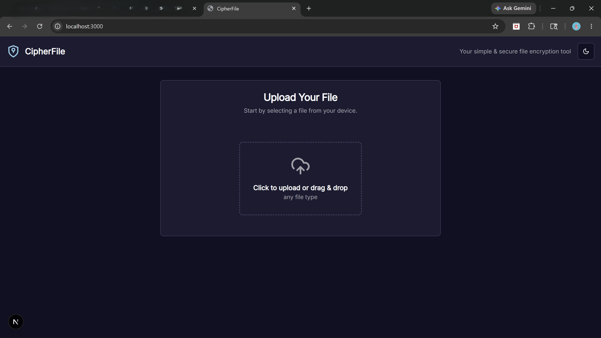
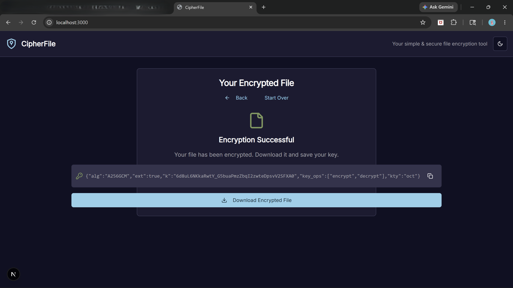
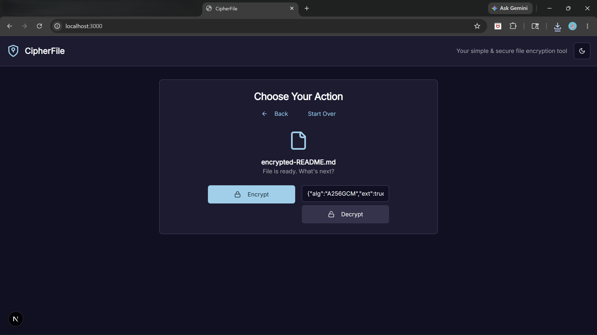
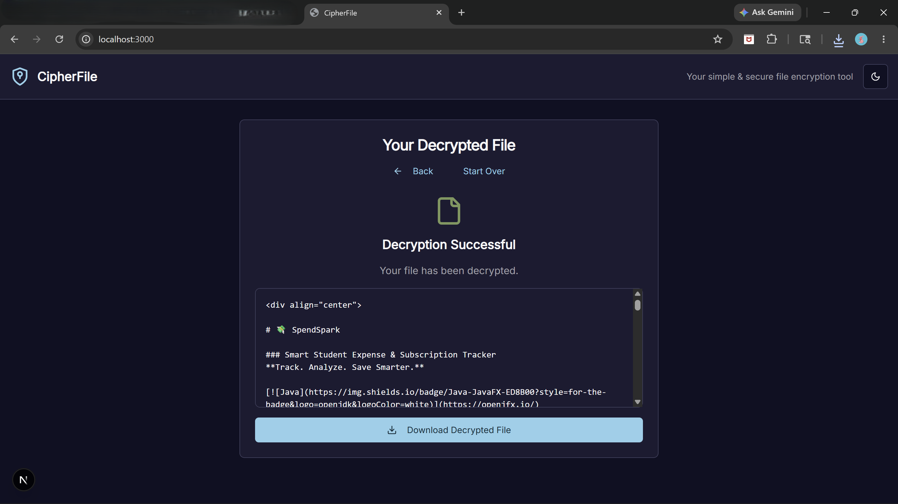

<div align="center">


<br>

# 🔐 CipherFile

### ⚡ Advanced Web-Based File Encryption & Decryption Platform

<p align="center">
Secure • Private • AES-256 • Cyber Security • Modern UI
</p>

<p align="center">
  
  
  
  
</p>

<p align="center">
  
</p>

</div>

---

## 🌌 About CipherFile

**CipherFile** is a futuristic **web-based file encryption and decryption platform** built to provide powerful, military-grade protection for sensitive files.

In a world where digital privacy matters more than ever, CipherFile helps users securely encrypt files before storing or sharing them, preventing unauthorized access and keeping confidential information protected.

Built using the browser’s native **Web Crypto API**, CipherFile delivers high-performance encryption while ensuring maximum privacy — your files stay on your device and are never uploaded to external servers.

> 🔒 **Your files. Your privacy. Your control.**

---

## ⚡ Core Features

### 🔐 AES-256 Encryption
Protect files using **AES-GCM (256-bit encryption)** — an industry-standard cryptographic algorithm trusted for strong security.

### 🔓 Secure File Decryption
Decrypt files safely with secure authentication to ensure file integrity and protection.

### ⚡ Lightning Fast Performance
Optimized encryption and decryption process for smooth and fast execution.

### 🛡️ Privacy Focused
Everything runs locally in your browser.

**No cloud uploads. No tracking. No data storage.**

### 🎨 Futuristic User Interface
Dark cyber-inspired UI with clean design and seamless user experience.

### 📂 Multiple File Support
Encrypt and decrypt important files with ease.

---

## 🔒 Encryption Architecture

CipherFile uses **AES-256 GCM (Galois/Counter Mode)** powered by the browser's native **Web Crypto API**.

### Security Specifications

| Feature | Details |
|----------|----------|
| Algorithm | AES-GCM |
| Key Length | 256-bit |
| Encryption Type | Symmetric Encryption |
| Integrity Check | Yes |
| Browser API | Web Crypto API |
| Security Level | Enterprise Grade |

### Why AES-GCM?

CipherFile uses **AES-GCM** because it provides:

✅ **Confidentiality** → Protects file contents from unauthorized access  
✅ **Authentication** → Detects tampering attempts  
✅ **High Performance** → Faster than older methods  
✅ **Modern Security Standard** → More secure than CBC mode

Example implementation:

```ts
async function generateKey() {
  const key = await crypto.subtle.generateKey(
    { name: 'AES-GCM', length: 256 },
    true,
    ['encrypt', 'decrypt']
  );
  return key;
}
```

---

## 🖥️ Tech Stack

<div align="center">


</div>

### Technologies Used

- ⚡ **Next.js**
- 📘 **TypeScript**
- 🎨 **Tailwind CSS**
- 🛡️ **Web Crypto API**
- 🟢 **Node.js**

---

## 📸 Project Preview

<div align="center">

### 🏠 Home Screen



---

### ⚙️ Choose Action


---

### 🔐 Encryption Success



---

### 🔓 Decryption Interface



---

### ✅ Decryption Success



</div>

---

## 📂 Folder Structure

```text
📦 CipherFile
┣ 📂 docs
┃ ┣ 📜 home.png
┃ ┣ 📜 choose-action.png
┃ ┣ 📜 encrypt-success.png
┃ ┣ 📜 decrypt-screen.png
┃ ┗ 📜 decrypt-success.png
┃
┣ 📂 src
┃ ┣ 📂 app
┃ ┣ 📂 components
┃ ┣ 📂 lib
┃ ┗ 📂 styles
┃
┣ 📂 public
┣ 📜 package.json
┣ 📜 next.config.ts
┣ 📜 tailwind.config.ts
┣ 📜 tsconfig.json
┗ 📜 README.md
```

---

## 🚀 Getting Started

### 1️⃣ Clone Repository

```bash
git clone https://github.com/om-3/CipherFile.git
```

### 2️⃣ Navigate to Project

```bash
cd CipherFile
```

### 3️⃣ Install Dependencies

```bash
npm install
```

### 4️⃣ Run Development Server

```bash
npm run dev
```

### 5️⃣ Open Browser

```text
http://localhost:3000
```

---

## 🎯 How To Use

### 🔐 Encrypt File

1. Upload your file
2. Select **Encrypt**
3. Generate secure AES-256 key
4. Download encrypted file

### 🔓 Decrypt File

1. Upload encrypted file
2. Select **Decrypt**
3. Enter key
4. Restore original file

---

## 🚀 Future Enhancements

- [ ] Multi-file encryption
- [ ] Password-based encryption
- [ ] Cloud backup integration
- [ ] Dark/Light theme switcher
- [ ] Encryption history logs
- [ ] Mobile responsiveness improvements

---

## 🤝 Contribution

Contributions are welcome.

If you'd like to improve CipherFile:

1. Fork the repository  
2. Create your feature branch  
3. Commit changes  
4. Push to branch  
5. Open a Pull Request

---
---

## 👨‍💻 Author

<div align="center">

# OM YERPUDE

<a href="https://github.com/om-3">

</a>

<a href="https://www.instagram.com/_om_3.y?igsh=MTA1aWYyYzRpczJueA==">

</a>

</div>

---

<div align="center">

### ⚡ Secure Your Files Like Never Before ⚡

<div align="center">


### 🔐 Securing Your Digital World with AES-256 Encryption


</div>


</div>
